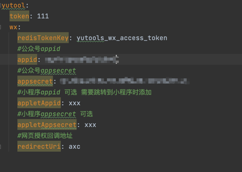
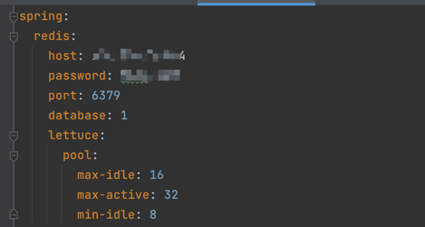

# yuTool

#### 介绍
工具类 主要用于微信的模版消息推送 菜单设置

#### 软件架构
软件架构说明
基于springboot创建
引用了hutool工具类

#### 安装教程

1.  在项目根目录 执行mvn clean install 打包后在项目引用

#### 使用说明

1.  项目中基于springboot  请在springboot项目中进行引用 
2. 引用依赖以后需要在启动类添加@EnableYuTools 将回启动注入
3. 采用了redis使用，使用此工具需要在项目中配置redis配置

#### 配置项

#### 参与贡献

1.  Fork 本仓库
2.  新建 Feat_xxx 分支
3.  提交代码
4.  新建 Pull Request

